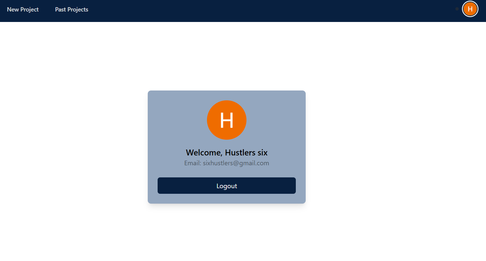
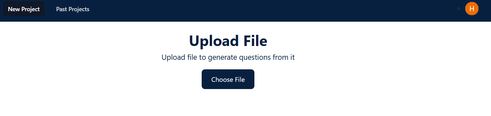
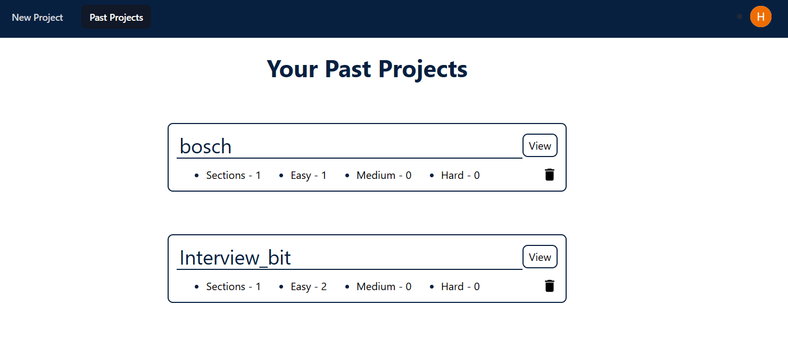
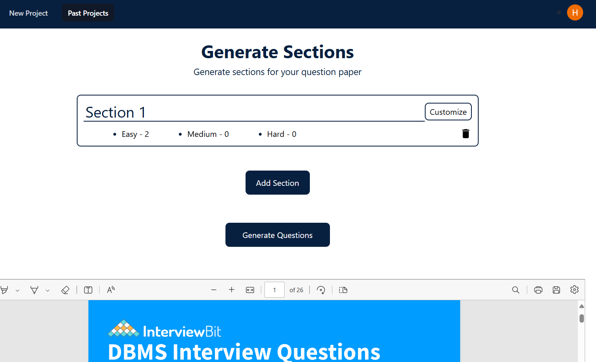
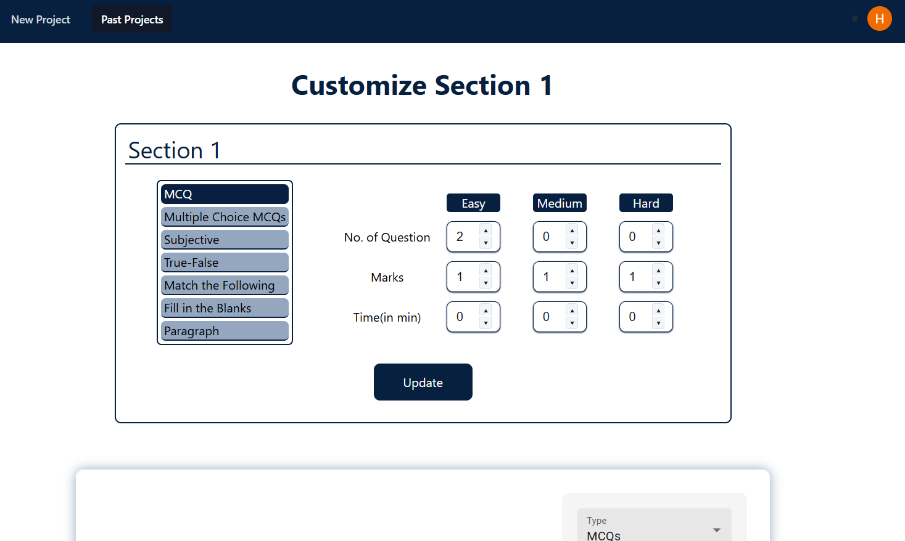
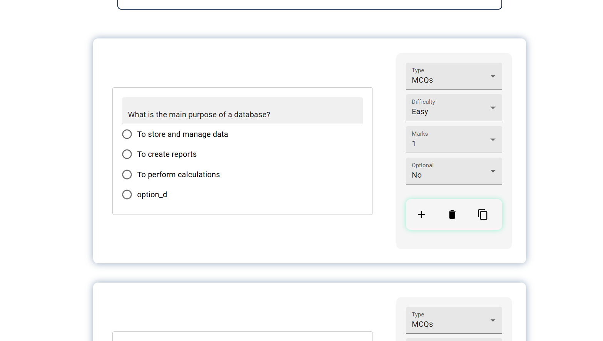

## Screenshots



---



---



---



---



---




---

## Description

This project can help teachers or students

Teachers :- to create a question paper with the help of AI based on thier own blueprint of the question paper.

Student :- focus and test thier knowledge on the specific topic by taking the test on single pdf.


## Project Structure

---

## Tech stack used:

The tech stack used here is,

- langchain
- LLM ollama llamma3.1

---


## Project setup instructions:
	
To install the dependencies use:

```
poetry install

```

Please install and setup docker before running the next steps.

To run LLM with gpu use:

Ensure you have nvidia container toolkit installed (check ollama image docs) and run the following commands:
```
docker pull ollama/ollama
docker run -d --gpus=all -v ollama:/root/.ollama -p 11434:11434 --name ollama ollama/ollama
docker exec -it ollama ollama run llama3.1

```

Reminder above commands are first time setup, for subsequent runs you can use the following command:
```

docker start ollama
docker exec -it ollama ollama run llama3.1

```

then run ngrok 

```
ngrok http --domain=pet-muskox-honestly.ngrok-free.app 5000
```


